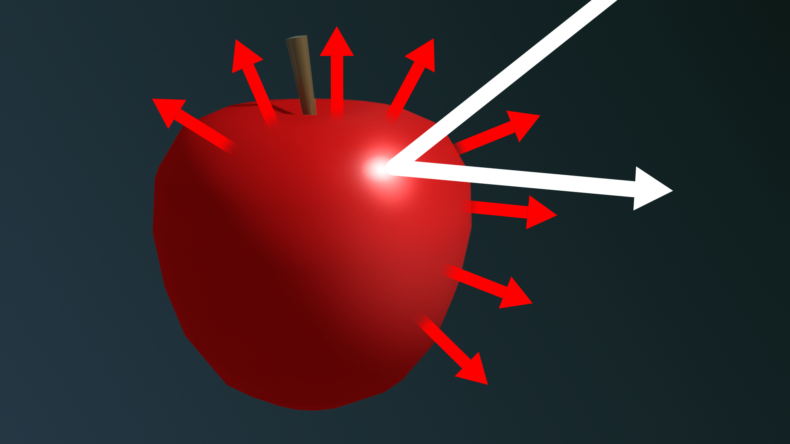
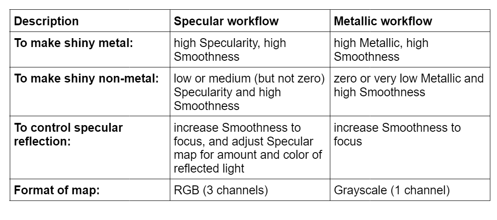
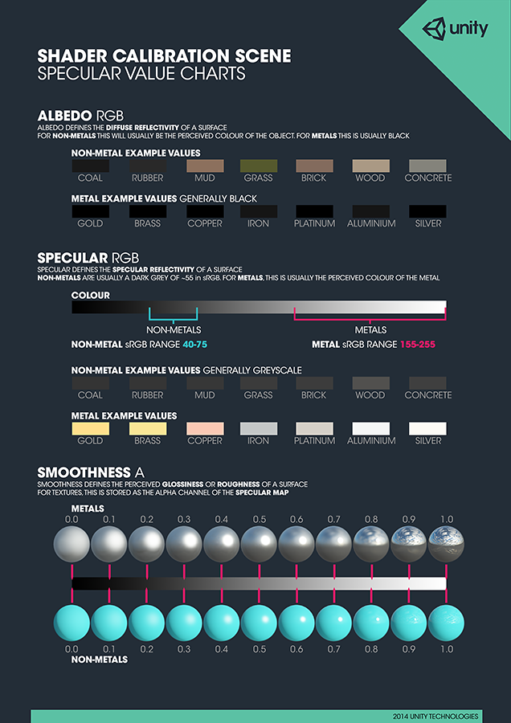
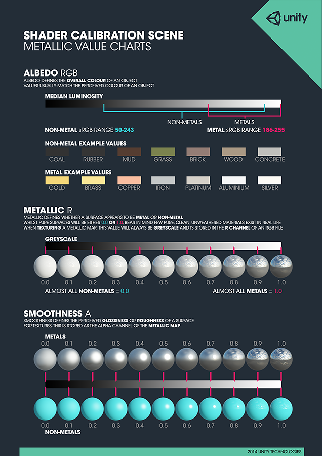

# Shaders and Materials

## Meshes
- the 3D skeleton of your GameObject
- every GameObject in Unity has a mesh
- the geometric element of the object.

### Mesh data
- a series of flat 2D polygons defined by vertices (singular: vertex), which are points in 3D space that are stored as XYZ coordinates.
- normals, which are additional values that define the direction the surface is facing. 

### Mesh Filter
- points to the mesh coordinate data in your project. 

### Mesh Renderer
- specify how the mesh will be rendered. 

## Materials
- an asset that works with a shader to define how meshes will be rendered
- one material can be applied to many meshes.

## Shaders

- a script that applies the properties contained in a material to render the meshes of your 3D objects to the 2D image on your screen. 
- each shader is written for a specific render pipeline.

### Types of shaders

- Based on purposes:
    - Fragment shading, also known as pixel shading, is the shading that represents mesh surfaces to produce the color of each pixel in the 2D image.
    - Vertex shading operates on the vertices of the mesh, typically changing their locations to make the surface move or transform. 

- Based on light reflection:
    - Lit shaders respond to the light in the scene, and unlit shaders don’t. 
    - Unlit shaders are useful for certain artistic effects or for optimised projects that run more efficiently by not using lighting.

#### Universal Render Pipeline Shaders

- 2D > Sprite-Lit-Default, Sprite-Mask, Sprite-Unlit-Default: Designed for 2D projects, these shaders are for flat objects only and will render any 3D object as 2D.
- Particles > Lit, Simple Lit, and Unlit: are for visual effects (VFX). 
- Terrain > Lit: optimized for use with the Terrain tools in Unity. As a lit shader, it will render based on the light in the scene that reaches the object.
- Baked Lit: automatically applied to lightmaps.
- Complex Lit, Lit, and Simple Lit: These are all variations on a general-purpose, physically based lit shader.
- Unlit: a shader that does not use light.

## Relationship between shaders and materials

- Shaders can be very specific or quite versatile. 
- A shader can set the color of GameObjects or it can allow color to be configurable by materials. In fact, one shader can make many objects look like entirely different substances, while still giving a scene a unified look.
- Shaders and materials work together as a team — the shader defines what a surface **can** look like, while the material defines what it **does** look like.

### Side notes
- When a material has a shader that is mismatched to the current render pipeline, it is bright magenta (pink) to alert you.

## How light behaves

When light comes in contact with any object, it can do one of three things: bounce off of it, which is known as reflection; pass through it, if the object is transparent or translucent; or be absorbed by it.

## Specular and diffuse reflections

- There are two ways that light reflects from an object: there are specular reflections and diffuse reflections.

### Specular reflections

- is the direct reflection that is most visible on shiny objects.  
- On the apple, the specular reflection is white, which indicates that the light source is white.
- For smooth surfaces:
    - Light is reflected in a specific direction
    - The intensity depends on the viewer’s position
- This is why:
    - Shiny objects (metal, glass) have visible highlights
    - Rough objects have softer or no highlights

### Diffuse reflections

- not all the light that reaches the apple bounces off it directly. 
- other light penetrates the surface, and passes through or bounces around the outer layers of the apple. Some of this light is absorbed and some bounces out. 
- the light that escapes is the diffuse reflection.
- determines its visible color. On the apple, the non-red light is absorbed, and the red light is reflected to our eyes.
- The brightness seen by the viewer does not depend on the viewing angle.
- It depends only on the angle between the surface normal and the light direction. If this angle is greater than 90°,the surface receives no direct light.

## Diffuse reflectivity

- In Unity, to represent diffuse reflectivity the URP/Lit Shader calls for a Base Map.
- Other shaders commonly call this property Albedo or Diffuse Map (these terms don’t mean exactly the same thing technically)

### What is albedo?

- describes the measurement of diffuse reflection. 
- typically specified as a regular color, expressed as three values for red, green, and blue (RGB values). 
- RGB values can be translated to values for hue, saturation, and luminosity (brightness). 
- the luminosity of the albedo color corresponds to the amount of diffuse reflection
- the hue and saturation describe the quality of light that escapes from the surface.

### Why is it called a map?

- Maps can be solid colors or they can be specified with 2D images to add variation to a surface. 

## Metals in the Specular workflow

- The property of a surface that makes it look like metal is called **specularity**.
- Specularity is different from smoothness. We could polish a red apple until it is very smooth, but it would never turn into metal that way. 
- However, to have any specular reflection, a smooth object must have some specularity

- Like diffuse surfaces, metals do absorb light. You can tell this is true if you leave a metal object in the sun — it gets hot! 
- But on colored metals, like gold and copper, the colored light we see is actually not a diffuse reflection — it is a tinted specular reflection. It must be specular because you can see the light sources in that reflection. The tint that you see is caused by the object absorbing part of the visible spectrum of light and only reflecting the tint color.

### Specular workflow

- In the Specular workflow:
    - A shiny metal has a high Specularity setting and a high Smoothness setting.
    - A shiny non-metal has a low Specularity setting and a high Smoothness setting.
    - Smoothness focuses the specular reflection, and the Specular Map controls the amount and color of the specular reflection.
    - The Specular Map can use RGB colors.

## Metals in the Metallic workflow

- The Metallic workflow is simpler, but doesn’t strictly follow the rules of physical light.

- In the Metallic workflow:
    - A shiny metal has a high Metallic setting and a high Smoothness setting.
    - A shiny non-metal has a zero or low Metallic value and a high Smoothness value.
    - Smoothness controls the focus of the specular reflection.
    - The Metallic map only uses grayscale.

### Which workflow should you use?
- When you import assets, you will see that some use the Specular workflow and others use Metallic. When you have a choice, you can use whichever you prefer. 

- The Metallic workflow is more common because it is easier to work with, but it is not as scientific. 
- The Specular workflow is based on real-world principles of reflectivity, but the coloured specular map makes it more challenging.

## Smoothness (gloss or glossiness)

- brings the specular reflection into focus. 
- from a smooth surface, light reflects in a uniform way so that you can see the shape of the light source in the reflection.

## Textures

- are regular image files in formats you might be familiar with, such as BMP, TIF, PNG, and JPG.
- The data in image files is organized into channels. 
- Black and white images, also known as grayscale images, have just one channel to indicate the shade of gray in each pixel. 
- Color images require three channels, red, green, and blue (RGB), which combine to create the colors you see on your computer display.
- Some image file formats have four channels: red, green, blue, and alpha (RGBA). The alpha channel typically contains transparency data.
- Each channel of an image file, by itself, is a matrix of numbers. In materials, these numbers can indicate other properties besides color or transparency — such as smoothness, specularity or metalness — and even the direction each pixel faces to create the appearance of physical features.

## Base map texture
- (also known as diffuse or albedo) is a regular RGB or RGBA color image file that defines the diffuse reflection — that is, the colors — for the surface of an object.
- can also include transparency information in the alpha channel of the map

## Tiled textures

- are designed to be tiled around any mesh. 
- the map in each file simply repeats like the tiles on a floor

- Note: Tiling and Offset settings apply to all the maps on the mesh.
    - Tiling is the number of tiles per unit on the surface of the mesh. A higher number makes the pattern smaller.
    - Offset begins the tiling at a different point. For example, an X Offset of 0.5 offsets the tiling by half the width of the texture.

## UV mapped textures

- Meshes made by modeling applications, such as Autodesk® 3ds Max® and Maya®, or Blender®, generate their own sets of 2D coordinates called UV coordinates. UV coordinates are like the XY coordinates in regular 2D spaces, but they are called UV to differentiate them from the coordinate system of the environment (XYZ). UV coordinates are relative to the mesh, not the 3D space in your scene.
- UV mapping is the process of unwrapping the surface of a 3D model to create a flat surface, then applying a 2D texture map to it. In the process, the modeling application generates the UV coordinates that allow the texture to be wrapped back onto the model.

## Notes
- The smoothness map is stored in the alpha channel of the texture file.
- Remember that lighter colors are high values and darker colors are lower values. For example, white areas on a smoothness map are the most smooth.
- Remember that the Specular workflow uses three color channels, and the Metallic workflow uses only R.

## Shader Graph Sandbox

### Transparency
- When rendering opaque objects, you tend to draw them starting with the closest object, because anything behind that object doesn't need to be drawn at all.
- It's obscured by the closer object and you get an efficiency win.

### Alpha-blended Transparency
- Transparent objects need to blend color with the color of the object behind it based on the alpha value of the object, this is called alpha-blended transparency
- Firstly, all opaque objects need to be drawn first before any transparent objects are drawn
- Unity enforces this with a queue system, whereby all shaders are assigned a queue number and lower numbers are drawn before higher numbers. In shader code, we specify the number manually but Shader Graph will automatically handle that for us.
- Second, it means that transparent objects are rendered back-to-front, with the furthest objects drawn first, and objects closer to the camera drawn later. This ordering ensures that overlapping transparent objects get their colors blended properly.
- By default, Shader Graph use opaque rendering. To enable transparency, go to Graph Settings > Surface Type > Transparent

### Alpha Clipping
- With alpha clipping, we can set a threshold, and any pixel with alpha below the threshold gets culled - it's not rendered
- To enable alpha clipping, go to Graph Settings > Surface Type > Opaque and check Alpha Clipping box

### Dithering Transparency

- simulates transparency without using alpha-blended transparency
- Instead of making every pixel semi-transparent, it:
    + Keeps some pixels fully visible
    + Discards others based on a pattern (noise or matrix)
→ From a distance, it looks like partial transparency

- Pros: 
    + Avoids transparency sorting issues
    + Works with opaque shaders (better depth handling)
    + More performance-friendly (no blending cost)
- Cons:
    + Looks grainy/noisy up close
    + Not as smooth as real transparency
    + Can flicker with camera movement
- Use cases: Fade in/out effects, LOD transitions. Stealth/invisibility effects

### Frame buffer

- The frame buffer is a block of memory that stores the final image to be displayed on the screen.
- Each pixel typically contains color information (e.g., RGB or RGBA).
- After rendering is complete, the frame buffer is presented to the display.

### Depth buffer

- Also called the z-buffer.
- A second buffer with the same dimensions as the frame buffer.
- Stores the distance between each rendered pixel and the camera.
- Depth values are usually stored in the range [0, 1].
- The mapping from distance to depth is non-linear, allocating more precision to objects closer to the camera to reduce visual artifacts.

### Depth Mapping

- For each pixel, Unity computes its distance from the camera (z-value).
- This value lies between the near and far clip planes.
- The z-value is transformed into a depth value using: depth = ( 1/z - 1/near ) / ( 1/far - 1/near )
- This produces a non-linear curve, concentrating precision near the camera.

### Why Non-Linear Depth?

- A linear mapping would distribute precision evenly.
- This can cause:
    + Z-fighting (incorrect rendering order)
    + Loss of precision for nearby objects
- With typical values (near = 0.3, far = 1000): ~70% of precision is used within the first meter. Remaining ~30% covers the rest of the scene

### Depth Testing

- During rendering, each fragment (potential pixel) has a computed depth value.
- This value is compared against the corresponding value already stored in the depth buffer.
- If the new fragment has a lower or equal depth value (i.e., closer to the camera), it passes the depth test:
    - The fragment’s color is written to the frame buffer.
    - The depth buffer is updated with the new depth value (for opaque objects).
- If the fragment fails the depth test:
    - It is discarded and does not affect the final image.
- The default setting for depth test is LEqual (less or equal)

### Transparency Considerations

- Opaque objects typically write to both the frame buffer and depth buffer.
- Transparent objects typically:
    + Write to the frame buffer only.
    + Do not update the depth buffer.
- Because of this, transparent objects usually need to be rendered after opaque objects and often require sorting (back-to-front) to produce correct visual results.
- The default setting for depth write is Auto (does write for opaque objects, does not for transparent object)

### Camera Depth Texture (URP)
- Shaders cannot directly read from the depth buffer during rendering.
- After all opaque objects have been rendered, Unity copies the depth buffer into a texture called the camera depth texture.
- This texture:
    + Contains valid depth information only for opaque objects.
    + Does not include depth data for transparent objects.
    + Is mainly useful when writing transparent shaders or screen-space effects.
- In the Unity Universal Render Pipeline (URP), this texture is not enabled by default.
    + It must be explicitly enabled in the pipeline assets before it can be accessed in shaders.
- Use cases: Silhouette

### Vertex Transformation Pipeline

- Each frame, Unity processes mesh data to determine where vertices appear on the screen.
- Vertices start in object space:
    - Positions are defined relative to the mesh’s local origin.
- They are then transformed into world space:
    - Using the object’s Transform (position, rotation, scale)
    - Now relative to the world origin
- Next, vertices move into view space (camera space):
    - Based on the camera’s position and orientation
    - The camera becomes the reference point
- Then into clip space:
    - Using the camera’s projection (perspective or orthographic)
    - This prepares vertices for projection onto the screen
- Finally, after perspective division, they end up in screen space:
    - Coordinates mapped to the 2D screen
### Vertex Shader
- This sequence of transformations is handled by the vertex shader.
- Its main job is to:
    - Transform vertex positions through these spaces
    - Pass data (e.g., UVs, normals) to the next stage
- In Shader Graph, these transformations are handled automatically behind the scenes

### Rasterization
- After vertex processing, the GPU performs rasterization to converts triangles into fragments (potential pixels)

### Fragment Shader

- The fragment shader runs for each fragment:
    - Determines the final color of each pixel
- It can use:
    - Textures
    - Lighting calculations
    - Depth and other data

### Ambient Light
- Represents a base level of lighting applied uniformly across the scene.
- Used to approximate indirect light bounce
- Example: A room lit indirectly by sunlight through a window

### Physically Based Rendering (PBR)
- In Unity, the Lit shader uses Physically Based Rendering (PBR).
- Instead of manually controlling lighting, you define material properties:
    - Albedo (Base Color): The inherent color of the surface
    - Smoothness / Roughness: Controls how sharp or spread out reflections are
    - Metallic: Determines whether the material behaves like metal or non-metal
- Based on these inputs, Unity automatically calculates:
    - Diffuse lighting
    - Specular reflections
    - Energy conservation (realistic light behavior)
- This results in:
    - More realistic and consistent rendering
    - Materials reacting naturally under different lighting conditions

### Displacement texture

- A grayscale texture that represents height variation across a surface.
- Black = low areas, white = high areas.
- Used to:
    - Physically displace vertices (true geometry change)
    - Or simulate depth using techniques like parallax mapping
- Parallax Mapping:
    - A cheaper alternative to real displacement
    - Offsets texture coordinates based on view angle to create a fake depth effect
    - Does not modify actual geometry
### Normals texture

- Encodes surface detail by modifying the normal direction per pixel
- Does not change geometry
- Result:
    - Light reacts as if the surface has small bumps and details
    - Improves realism with minimal performance cost

### Roughness texture

- Controls how rough or smooth a surface appears
- Values:
    - Black (0) → perfectly smooth (sharp reflections)
    - White (1) → very rough (diffuse, blurry reflections)

### Smoothness texture
- The inverse of roughness
- Values:
    - Black (0) → rough surface
    - White (1) → smooth surface

### Emission

- Defines areas of a material that emit light
- Characteristics:
    - Not affected by scene lighting
    - Appears self-illuminated
- Common uses: Screens, LEDs, neon, glowing effects

### Ambient Occlusion texture
- Describes how much each part of a surface is occluded from ambient light
- Values:
    - 0 (black) → fully exposed to ambient light
    - 1 (white) → fully occluded (less ambient light reaches it)
- Effect:
    - Adds subtle shadowing in crevices and corners
    - Enhances perceived depth and realism